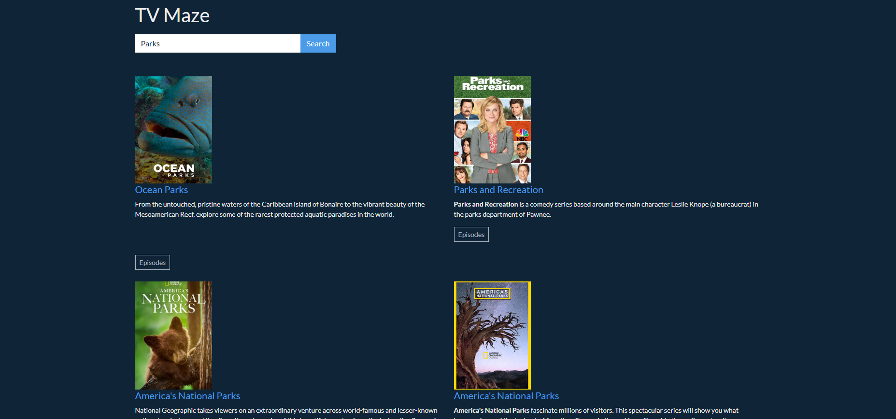
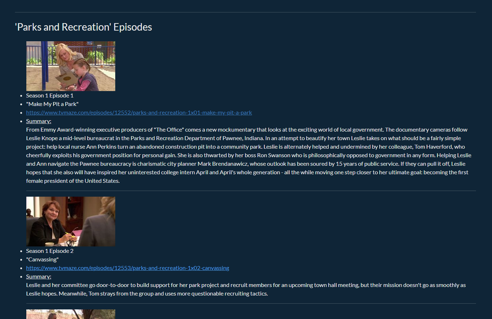

# TV Maze

This app utilizes the TV Maze API to generate a search result of TV Series based off user input. A user can then click on a show's "Episodes" to generate a list of all episodes with a few basic details & synopsis, including a link for more information.

     

     

## My Contribution
Starter code was provided for me. I had to fill out some existing functionality and add more. I had to handle the AJAX requests, add images to the populated data, and add the episodes list. Some styling was provided for me already.
